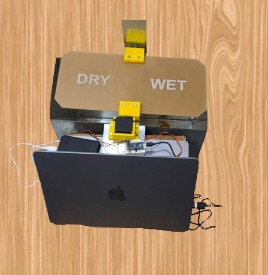

# Rainbin

This is my very first project on AI. I have used YOLO (You Only Look Once) model for object detection and classification. Not only that, for this project I have used sheet metal shop, spot welding, laser cutting of acrylic and 3D printing for the very first time.
I am proud of this project and how it turned out.

This project is an AI-powered dustbin that automatically sorts waste into dry or wet compartments based on image recognition. The dustbin uses the YOLO (You Only Look Once) model for object detection and classification.

[Demo Video Link](https://www.youtube.com/watch?v=FYRIHkF-pGQ)

## Features

- **Image Recognition**: Utilizes the YOLO model to identify the type of waste.
- **Automatic Sorting**: The dustbin lid opens to the appropriate compartment (dry or wet) based on the detected waste type.
- **Communication**: The system communicates with a laptop running the AI model and an Arduino that controls the servo motor attached to the lid.
- **Durable Construction**: Made with a galvanized iron sheet metal body and an acrylic sheet lid and strong servo for large weight tolerance.

## Components

- **Galvanized Iron Sheet Metal Body**: Provides a sturdy and durable structure.
- **Acrylic Sheet Lid**: Transparent lid for easy visibility.
- **Laptop**: Runs the YOLO model for image recognition.
- **Arduino**: Controls the servo motor for the lid mechanism.
- **Strong Servo Motor**: Operates the lid to open to the correct compartment.

## How It Works

1. **Image Capture**: An image of the object placed on the dustbin is captured.
2. **Object Detection**: The YOLO model processes the image to identify the type of waste.
3. **Classification**: The waste is classified as either dry or wet.
4. **Lid Operation**: The Arduino receives the classification result and controls the servo motor to open the lid to the appropriate compartment.

## Setup Instructions

1. **Hardware Setup**:
    - Assemble the dustbin body using galvanized iron sheet metal.
    - 3D Print the required parts for the lid mechanism.
    - Attach the acrylic sheet lid to the top of the dustbin after drilling holes.
    - Connect the servo motor to the lid mechanism.
    - Connect the Arduino to the servo motor.

2. **Software Setup**:
    - Install the necessary libraries and dependencies for the YOLO model on your laptop.
    - Upload the Arduino code (arduino_comm.ino) to the arduino board for controlling the servo motor.
    - Run App.py on your laptop to start the image recognition process. It asks for the port of the Arduino board. Enter the port and press enter.

## Usage

1. Place the object on the dustbin lid.
2. The system will capture an image and process it using the YOLO model.
3. The lid will automatically open to the dry or wet compartment based on the classification result.
